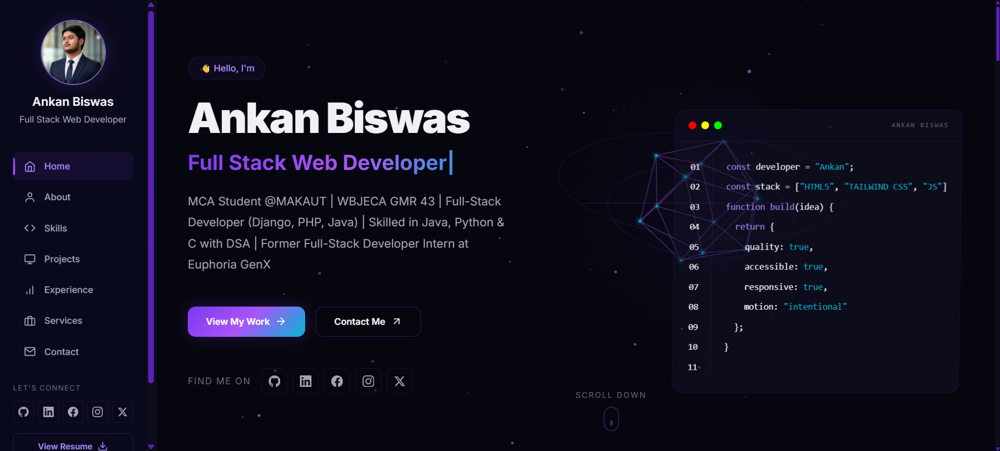

# Ankan Biswas — Portfolio Website



A hand-coded, multi-page portfolio website for **Ankan Biswas**, a Full Stack Web Developer. It's built with plain HTML, one custom CSS design system, and framework-free JavaScript (ES modules + Web Components) — **no bundler, no npm, no build step**.

**Live site:** https://ankan-76.github.io/portfolio/

## ✨ Key Features

- **Persistent glassmorphism sidebar** — a `<portfolio-sidebar>` Web Component (Shadow DOM) with 9 nav links, automatic active-page highlighting, social links, and a résumé button.
- **Animated hero** — a Canvas 2D "3D" scene (wireframe icosahedron + particle field + orbital rings) driven by a `requestAnimationFrame` loop.
- **Typewriter headline** — cycles through "Full Stack Web Developer", "Tech Enthusiast" and "Problem Solver".
- **Floating code window** — a 3D-tilted editor mock that floats in the hero on extra-large screens.
- **Scroll-reveal animations** — powered by `IntersectionObserver` with staggered per-card delays.
- **3D card tilt** — pointer-driven `rotateX/rotateY` perspective tilt on `.card-3d` elements.
- **View Transitions API** — same-origin navigations are intercepted for a smooth cross-page transition (progressive enhancement).
- **Filterable project gallery** — All / Web Apps / Dashboards / Other filters that re-trigger the reveal animation.
- **Animated "My Work Process"** — a 4-step loop that highlights each step in turn.
- **Working contact form** — posts to Web3Forms, keeping the site completely backend-free.
- **Accessibility built in** — semantic landmarks, `aria-label`/`aria-labelledby`, `aria-current="page"`, focus-visible styles, Escape-to-close mobile menu, and full `prefers-reduced-motion` support.
- **SEO + PWA ready** — canonical URLs, Open Graph and Twitter cards, JSON-LD structured data, `sitemap.xml`, `robots.txt`, `site.webmanifest`, and a styled `404.html`.

## 🛠️ Technology Stack

| Layer | What's used |
|---|---|
| Markup | HTML5 — semantic sections and ARIA landmarks |
| Styling | `css/styles.css` — a single hand-written design system (custom properties, fluid `clamp()` typography, keyframes, media queries) |
| Utility CSS | Tailwind CSS via the Play CDN (`https://cdn.tailwindcss.com`) with a small inline `tailwind.config` per page |
| Behaviour | Vanilla JavaScript ES modules (`<script type="module">`) |
| Components | Native Web Components with Shadow DOM — `portfolio-sidebar`, `portfolio-footer` |
| Graphics | HTML5 Canvas 2D (`js/hero-3d.js`) |
| Motion | `IntersectionObserver`, View Transitions API, CSS keyframes |
| Forms | Web3Forms API (`POST` endpoint, no server code) |
| Hosting | GitHub Pages deployed by GitHub Actions |

> There is **no `package.json`**, no dependency install, and no build/test/lint pipeline — the repository is served exactly as it is committed.

## 📁 Project Structure

```
portfolio/
├── .github/workflows/static.yml   # GitHub Pages deployment workflow
├── index.html                     # Home — hero + snapshot of every section
├── about.html                     # About, values, quote, "View CV"
├── skills.html                    # 6 categories / 25 skill cards
├── projects.html                  # Filterable project gallery
├── experience.html                # Work + education timelines
├── services.html                  # Services, "Why Choose Me", work process
├── achievements.html              # Milestones, awards, and recognitions
├── blog.html                      # Thoughts, tutorials, and insights on web development
├── contact.html                   # Contact info + Web3Forms contact form
├── 404.html                       # Styled not-found page
├── css/styles.css                 # The entire design system
├── js/
│   ├── main.js                    # Entry point / orchestrator
│   ├── animations.js              # Reveal, entrance, tilt, typewriter, process loop
│   ├── navigation.js              # Smooth anchor scroll + View Transitions
│   ├── hero-3d.js                 # Canvas hero scene (lazy-imported)
│   └── components/
│       ├── portfolio-sidebar.js   # <portfolio-sidebar> Web Component
│       └── portfolio-footer.js    # <portfolio-footer> Web Component
├── assets/
│   ├── images/profile/profile_Pic.png
│   ├── images/projects/*.png      # 5 project screenshots
│   ├── education/*                # WBBSE, WBCHSE, GCST, KGEC, MAKAUT logos
│   ├── experience/*               # GitHub, Euphoria GenX, YBI logos
│   └── icons/*.svg                # VS Code, Power BI
├── resume/resume.pdf
├── site.webmanifest
├── sitemap.xml
└── robots.txt
```

## 📄 Pages at a Glance

| Page | Sections |
|---|---|
| `index.html` | Hero (canvas + typewriter + floating code window) → Selected Work → About snapshot → Education snapshot → Skills snapshot → Services snapshot → CTA |
| `about.html` | Page hero → Intro + profile card (availability status dot) + stats → "What drives me" values → Quote + **View CV** |
| `skills.html` | Page hero → Programming Languages → Frontend → Backend → Development → Tools & Platforms → Core Competencies |
| `projects.html` | Page hero → Filter bar → 6 project cards → CTA |
| `experience.html` | Page hero → Work Experience timeline (GitHub, Euphoria GenX, YBI Foundation) → Education timeline (MCA, BCA, WBCHSE, WBBSE) → Quote |
| `services.html` | Page hero → Service cards → Why Choose Me → My Work Process (4 animated steps) → CTA |
| `achievements.html` | Page hero → Achievements grid (WBJECA Rank, College Rank) |
| `blog.html` | Page hero → Blog grid (Web Dev, JavaScript, Backend articles) |
| `contact.html` | Page hero → Contact info cards + social links → "Send a Message" form |
| `404.html` | Full-screen gradient 404 with "Go Home" / "Contact Me" actions |

Every inner page starts with a shared breadcrumb + `page-hero` header and ends with the shared `<portfolio-footer>`.

## 🧩 JavaScript Architecture

| Module | Responsibility |
|---|---|
| `js/main.js` | Imports every module, boots them on `DOMContentLoaded`, lazily imports `hero-3d.js` only when `#hero-canvas` exists, and runs the project-filter logic. |
| `js/animations.js` | `initScrollReveal()` (IntersectionObserver + `revealed` class), `initHeroEntrance()` (staggered hero entrance), `initCardTilt()` (pointer tilt on `.card-3d`), `initTypewriter()` (reads `data-words`), `initWorkProcessAnimation()` (2.5s step loop). |
| `js/navigation.js` | `initNavigation()` for smooth `#` anchor scrolling and `initPageTransitions()` which intercepts same-origin links with `document.startViewTransition`. |
| `js/hero-3d.js` | `Hero3D` class + `initHero3D()` — wireframe icosahedron, particle field, orbital rings, resize handling, `requestAnimationFrame` loop and cleanup. |
| `js/components/portfolio-sidebar.js` | Shadow-DOM custom element: nav data model, active-link detection from `location.pathname`, hamburger + overlay drawer, Escape/overlay close, focus management, socials and résumé link. |
| `js/components/portfolio-footer.js` | Shadow-DOM custom element: brand block, "Pages" / "More" link columns, 5 social icons, `© 2026` copyright and a back-to-top button. |

Every animation module bails out early — or reveals all content immediately — when the visitor has `prefers-reduced-motion: reduce` enabled.

## 🎨 Design System

Everything visual lives in `css/styles.css`, driven by the custom properties in its **DESIGN TOKENS** block:

| Group | Values |
|---|---|
| Backgrounds | `--color-bg-primary: #06060f`, `--color-bg-secondary: #0c0c1d`, `--color-bg-tertiary: #111128`, `--color-surface: #14142b` |
| Accent | `--color-accent: #7c3aed`, `--color-accent-light: #a78bfa`, `--color-accent-dark: #5b21b6`, `--color-accent-secondary: #06b6d4`, gradient `135deg → #7c3aed → #a855f7 → #06b6d4` |
| Text | `--color-text-primary: #f1f0f5`, `--color-text-secondary: #a5a3b5`, `--color-text-muted: #6b6980` |
| Typography | `--text-xs` → `--text-5xl`, all fluid `clamp()` values |
| Layout | `--sidebar-width: 240px`, `--sidebar-collapsed: 80px` |
| Effects | `--shadow-glow`, `--shadow-glow-lg`, `--color-accent-glow` |
| Status | `--color-success: #34d399`, `--color-warning: #fbbf24`, `--color-error: #f87171` |

The stylesheet is organised into labelled blocks: design tokens → base reset → custom scrollbar → layout → typography → buttons → cards → section layout → breadcrumb → page hero → social icons → footer → hero → scroll indicator → keyframes → scroll reveal → hero entrance → tech badges → timeline → CTA banner → contact form → filter buttons → project cards → service cards → skill cards → experience logos → about profile → about stats → mobile overlay → focus styles → reduced motion → background grain → utilities → mobile responsiveness → work process animation → form styles.

**Breakpoints**

- `min-width: 1024px` **and** `pointer: fine` — custom thin scrollbar and the sidebar layout (`margin-left: var(--sidebar-width)`).
- `max-width: 1023px` — the sidebar becomes a slide-in drawer with an overlay and the main content goes full width.
- `max-width: 767px` — single-column grids (`.mobile-1col`), stacked timelines, and tap-to-expand details (`.mobile-accordion-content.expanded`).
- `prefers-reduced-motion: reduce` — animations are disabled and content is shown immediately.

## 🚀 Getting Started

Nothing to install — this is a static site.

1. **Clone the repository**
   ```bash
   git clone https://github.com/Ankan-76/portfolio.git
   cd portfolio
   ```
2. **Serve it locally** (recommended so ES modules and relative paths behave exactly like production)
   ```bash
   python -m http.server 8000
   ```
   Any static server works — for example the VS Code **Live Server** extension. Opening `index.html` directly via `file://` mostly works, but module imports and the Canvas hero are more reliable over `http://`.
3. **Open** http://localhost:8000

There is no compile step: edit the HTML/CSS/JS and refresh.

## 📦 Deployment

Deployment is fully automated by `.github/workflows/static.yml`:

- **Trigger:** push to `main` (plus manual `workflow_dispatch`).
- **Pipeline:** `actions/checkout@v4` → `actions/configure-pages@v5` → `actions/upload-pages-artifact@v3` (uploads the whole repository) → `actions/deploy-pages@v5`.
- **Concurrency:** the `pages` group allows one deployment at a time and lets in-progress production deployments finish.

To publish a change, commit and push to `main` — GitHub Pages is rebuilt from the repository root. The site is live at **https://ankan-76.github.io/portfolio/**.

## 🔍 SEO & Metadata

- Canonical URL on every page.
- Open Graph + Twitter Card tags (`og:title`, `og:description`, `og:image`, `twitter:card`).
- JSON-LD structured data: `WebSite` + `Person` (with `sameAs` social profiles) on the homepage, `WebPage` on the about page.
- `sitemap.xml` lists all 9 indexable pages with priorities (`/` = 1.0, projects = 0.9, about/skills/contact = 0.8, experience/services/achievements/blog = 0.7).
- `robots.txt` allows all crawlers and points to the sitemap.
- `site.webmanifest` sets the theme colour (`#7c3aed`) and standalone display mode.


## 🖼 Featured Projects

The gallery on `projects.html` is filterable by category:

| Project | Category | Stack | Links |
|---|---|---|---|
| Portfolio Website *(featured)* | Web Apps | HTML5, Tailwind CSS, JS | [Live](https://ankan-76.github.io/portfolio/) · [GitHub](https://github.com/Ankan-76/portfolio) |
| Ankan Gaming Zone | Web Apps | HTML5, Bootstrap, JS | [Live](https://ankan-76.github.io/Ankan-Gaming-Zone/) · [GitHub](https://github.com/Ankan-76/Ankan-Gaming-Zone) |
| E-Commerce Store *(featured — placeholder)* | Web Apps | HTML5, CSS3, JS, REST API | ⚠️ not linked yet |
| Task Management App | Web Apps | HTML5, Tailwind CSS, JS | [Live](https://ankan-76.github.io/task-manager/) · [GitHub](https://github.com/Ankan-76/task-manager) |
| Weather Dashboard | Dashboards | HTML5, Tailwind CSS, JS, Weather API | [Live](https://ankan-76.github.io/weather-dashboard/) · [GitHub](https://github.com/Ankan-76/weather-dashboard) |
| Expense Tracker | Dashboards | HTML5, Tailwind CSS, JS, Local Storage | [Live](https://ankan-76.github.io/expense-tracker/) · [GitHub](https://github.com/Ankan-76/expense-tracker) |

The homepage's **Selected Work** section highlights Portfolio Website, Expense Tracker and Weather Dashboard.

## 👨‍💻 About Me

I'm a Software Developer and MCA candidate with a strong foundation in computer science and a **WBJECA General Merit Rank of 43**. I specialise in building clean, responsive, and user-friendly full-stack web applications that turn ideas into practical digital solutions — currently working across **Java, Python, C, Django, PHP and JavaScript**.

Featured highlights from the site:

- **MCA @ KGEC (MAKAUT)**, 2026 – present.
- **BCA @ Global College of Science and Technology (MAKAUT)**, 2023 – 2026.
- **Web Development Intern @ Euphoria GenX** (Jul 2025 – Aug 2025, Kolkata) and **Python Developer Intern @ YBI Foundation** (Jun 2025 – Jul 2025, remote).
- Open-source / GitHub contributor.

## ⚠️ Known Gaps / TODO

Notes on the current state of the repository — useful for the next round of work:

- **`E-Commerce Store` card is a placeholder.** In `projects.html` it still renders a "Project Screenshot" placeholder block, its Live Demo link is literally `[Live Demo URL]`, and the GitHub link points at the profile instead of a repository.
- **`favicon.ico` is referenced but missing.** Every page includes `<link rel="icon" href="favicon.ico">`, yet no such file exists in the repository root.
- **`site.webmanifest` has no icons** — its `icons` array is empty, so the manifest adds little beyond theme colour and display mode.
- **Social preview image is missing.** The homepage's `og:image` points at `assets/images/og-image.png`, which has not been added, so link previews have no image.
- **Tailwind runs from the Play CDN**, which compiles styles in the browser and is not recommended for production. Precompiling via the Tailwind CLI (which would introduce a `package.json` and a build step) is the natural next step.
- **The Web3Forms `access_key` is committed inline** in `contact.html`. That is expected for a client-side form, but rotating the key requires editing the page.
- **No tests, no linting, no `.gitignore`** — there is currently no automated quality gate on pushes to `main`.
- **"3D" is Canvas 2D.** `js/hero-3d.js` projects a wireframe shape manually rather than using WebGL/Three.js; it's lightweight and dependency-free but not a true 3D renderer.
- `404.html` is intentionally excluded from `sitemap.xml`.

## 📬 Let's Connect

- **LinkedIn:** [linkedin.com/in/ankanbiswas43](https://www.linkedin.com/in/ankanbiswas43)
- **GitHub:** [github.com/Ankan-76](https://github.com/Ankan-76)
- **X (Twitter):** [x.com/Ankan7699](https://x.com/Ankan7699)
- **Facebook:** [facebook.com/Ankan7699](https://www.facebook.com/Ankan7699)
- **Instagram:** [instagram.com/ankan_76](https://www.instagram.com/ankan_76)
- **Email:** via the [contact form](https://ankan-76.github.io/portfolio/contact.html)

---

*Designed & Developed by Ankan Biswas*

